# Generating Voucher Tutorial

This guide shows how to prepare your router, create a voucher profile, generate vouchers, and print them from the panel.

## 1. Set the NAS ID on your router or access point

Before generating vouchers, you need to assign a NAS ID to your router or AP. In this example, MikroTik is used. In Winbox, go to `System` and then `Identity`.

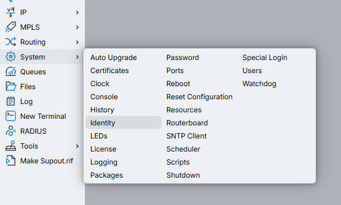

## 2. Open the NAS / Router page in the panel

In the panel, click `NAS / Router`.

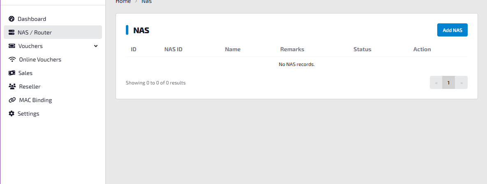

## 3. Add a new NAS entry

Click `Add NAS`. The NAS ID is important because the RADIUS app checks this first. If the NAS ID does not match the router identity, the request will be rejected. In this example, the NAS ID is `NAS-001`, so the same value is used in MikroTik Identity.

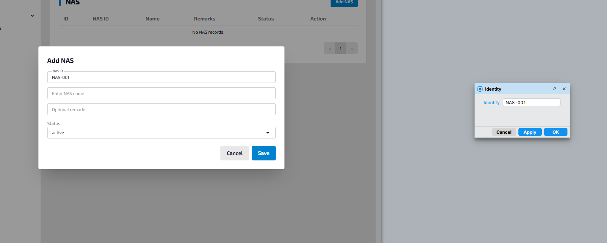

## 4. Save the NAS settings

Fill in the other required details, then click `Save` in the panel. In MikroTik, click `OK`.

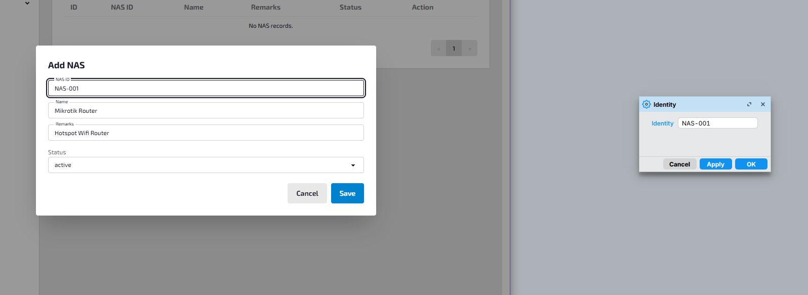

## 5. Open voucher profiles

In the panel, go to `Vouchers` and then click `Profiles`.

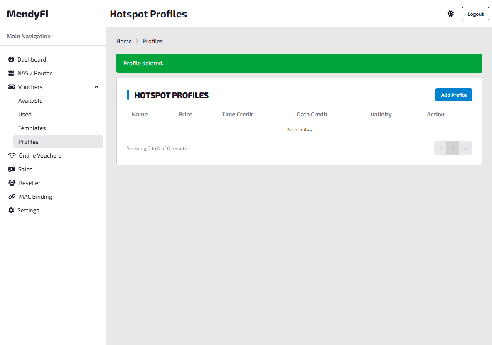

## 6. Create a new voucher profile

Click `Add Profile`, then enter the profile details.

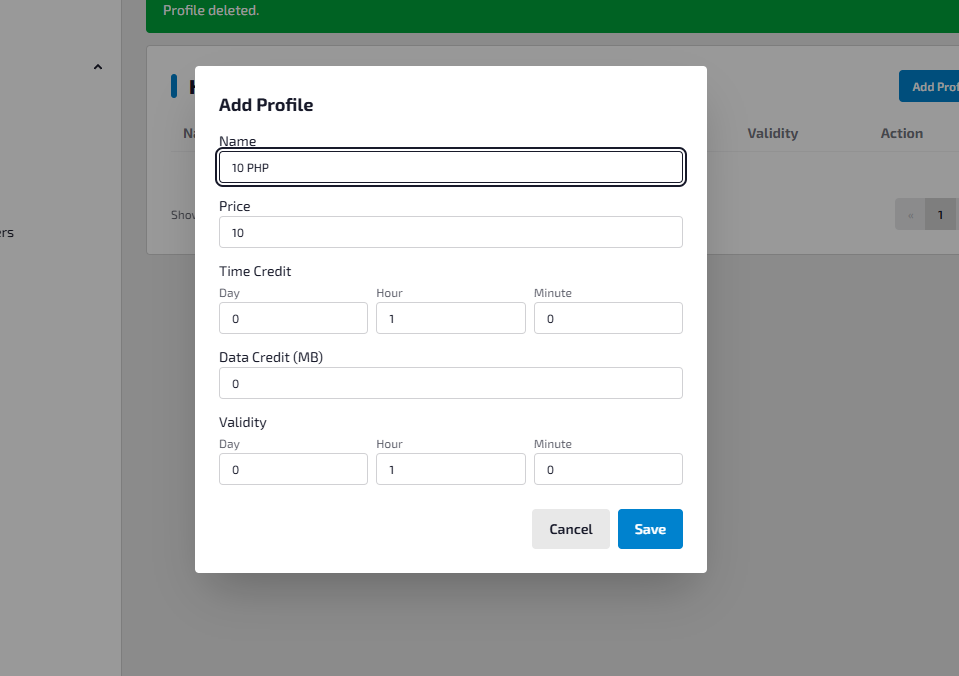

## 7. Save the profile

After entering the profile information, click `Save`.

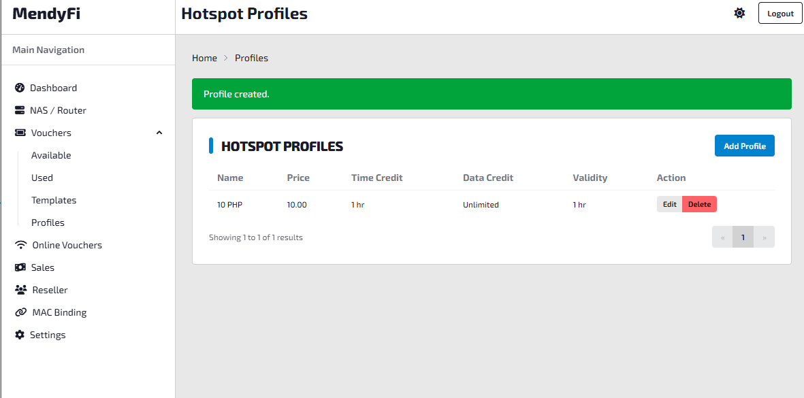

## 8. Open available vouchers

Now that the profile is ready, go to `Vouchers` and then select `Available`.

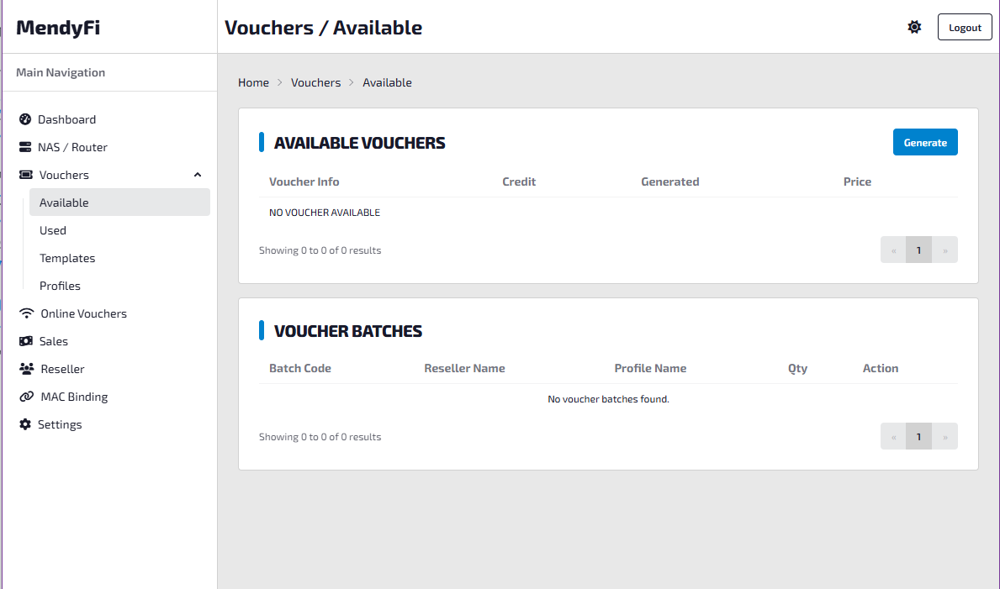

## 9. Generate vouchers

Click `Generate`, fill in the required information, then click `Generate` again.

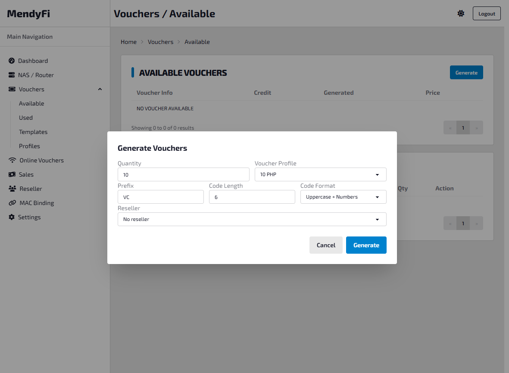

## 10. Open voucher templates

To print vouchers, you need a voucher template. In the panel, click `Vouchers` and then `Templates`.

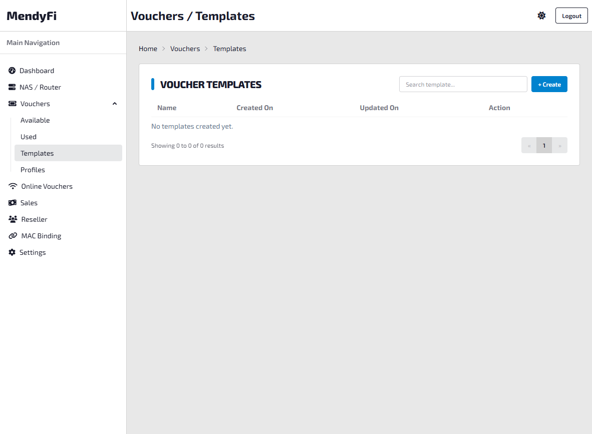

## 11. Create a template

Click `Create`. A default template is available, so you only need to give it a name first. If you know HTML and CSS, you can customize the design later.

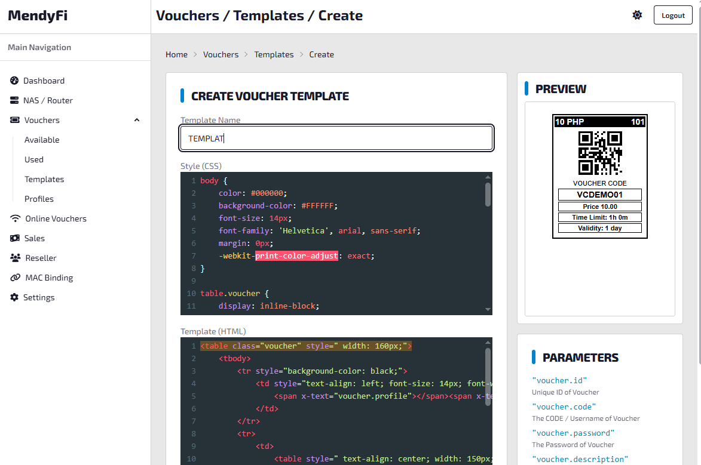

## 12. Save the template

Click `Create` to save the new template.

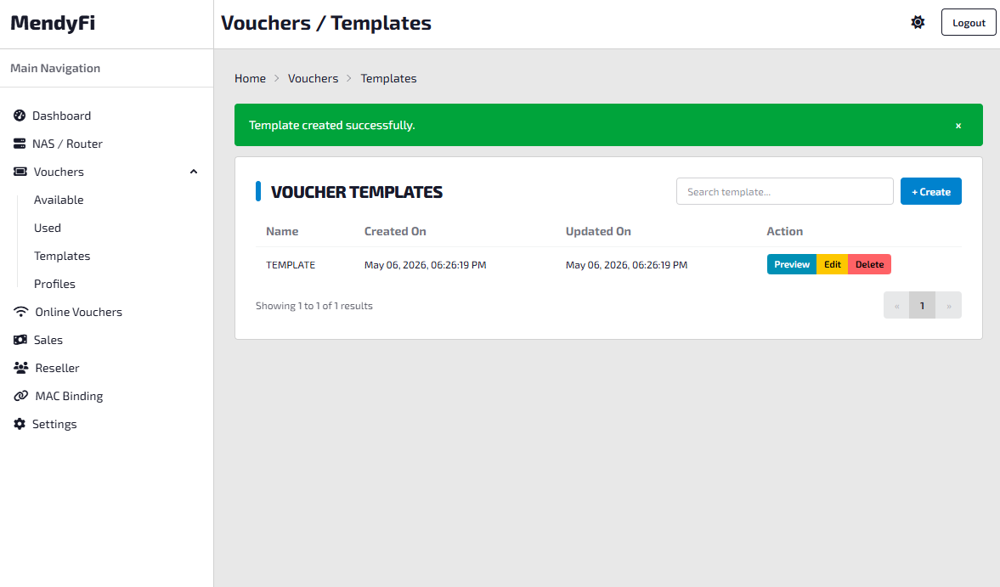

## 13. Open the voucher batch for printing

Go back to `Vouchers` and then `Available`. In the `Voucher Batches` table, you will see the batch you generated earlier. Click the `Print` button.

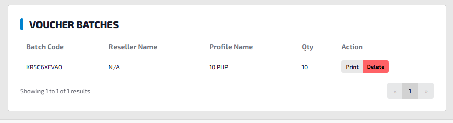

## 14. Select the template and print

Choose the template you created, then click `Print`.

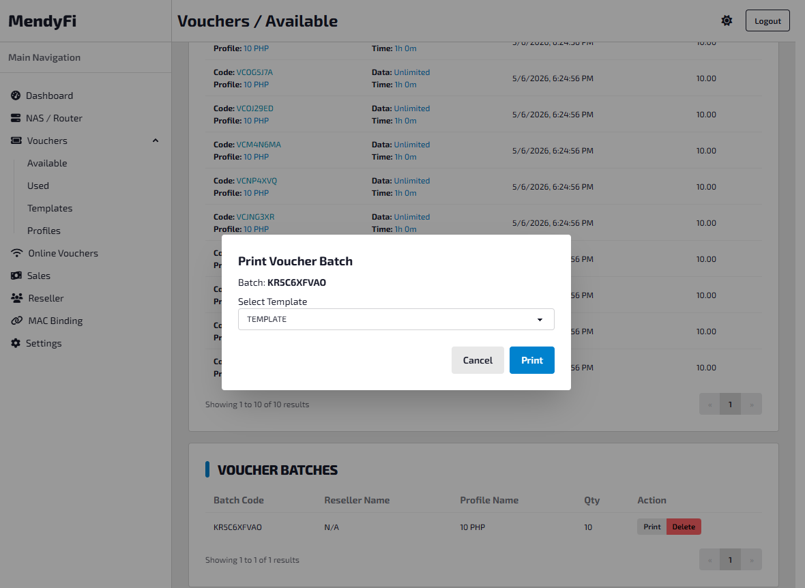