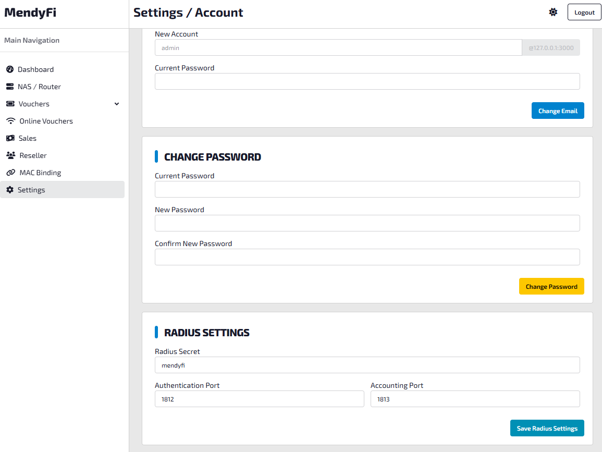
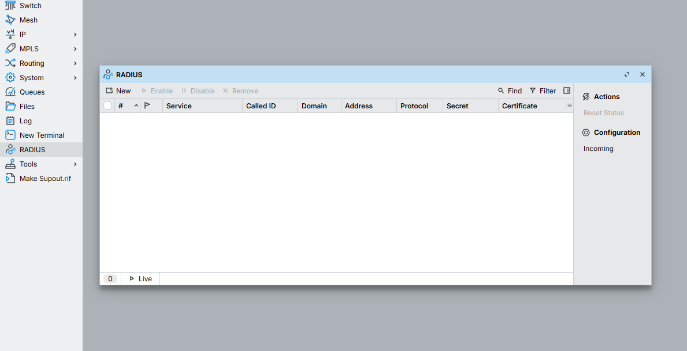
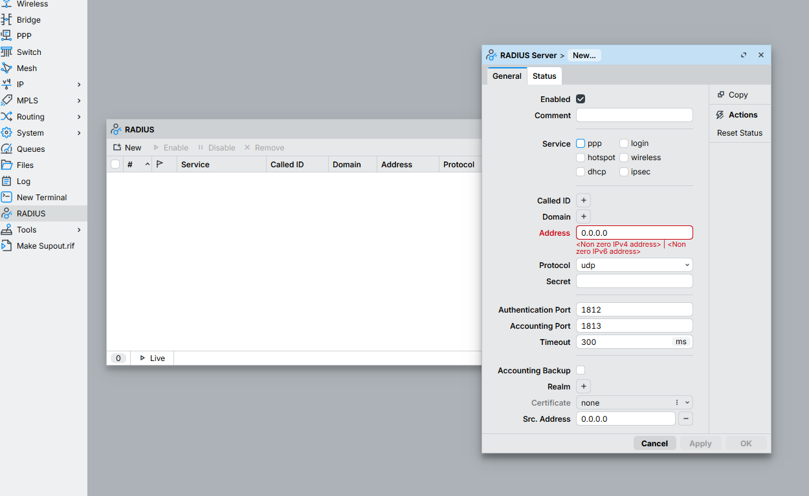
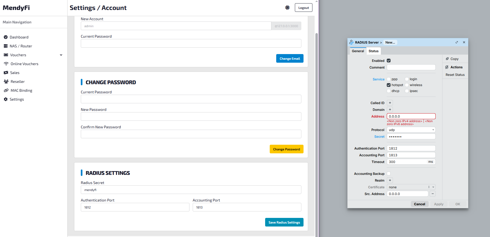
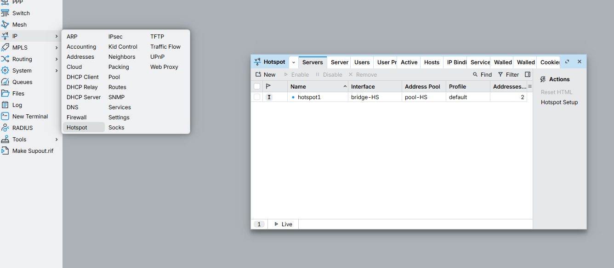
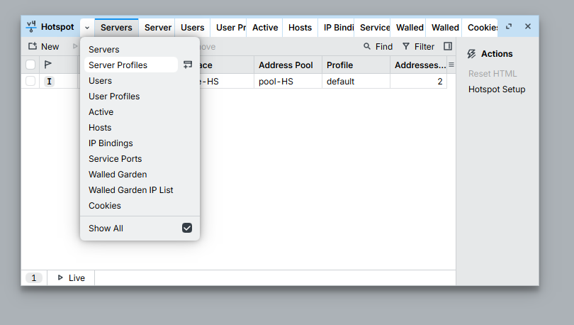
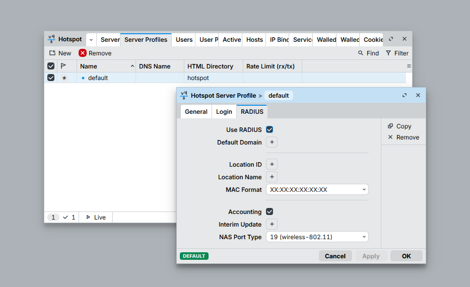

# Simple RADIUS Setup Tutorial

This guide shows how to copy the RADIUS settings from the panel and apply them in MikroTik using Winbox.

## 1. Open the panel and check the RADIUS settings

After you open the panel and log in, go to the settings page and review the RADIUS details.

## 2. Open RADIUS in Winbox

In Winbox, open the `RADIUS` menu.

## 3. Create a new RADIUS entry

Click `New` to add a new RADIUS server.

## 4. Copy the panel settings into MikroTik

Copy the RADIUS details from the panel into the MikroTik RADIUS settings.

## 5. Open Hotspot settings

To enable RADIUS for Hotspot, go to `IP` and then select `Hotspot`.

## 6. Open Server Profiles

Click the dropdown arrow, then select `Server Profiles` from the list.

## 7. Enable RADIUS in the default profile

Open the default profile, go to the `RADIUS` tab, then check `RADIUS` to enable it.

